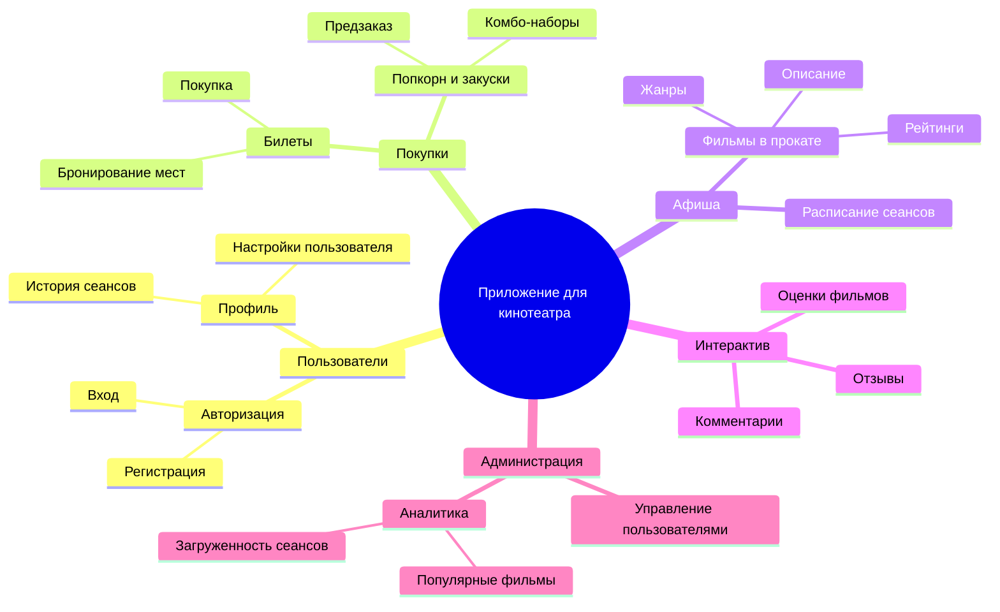
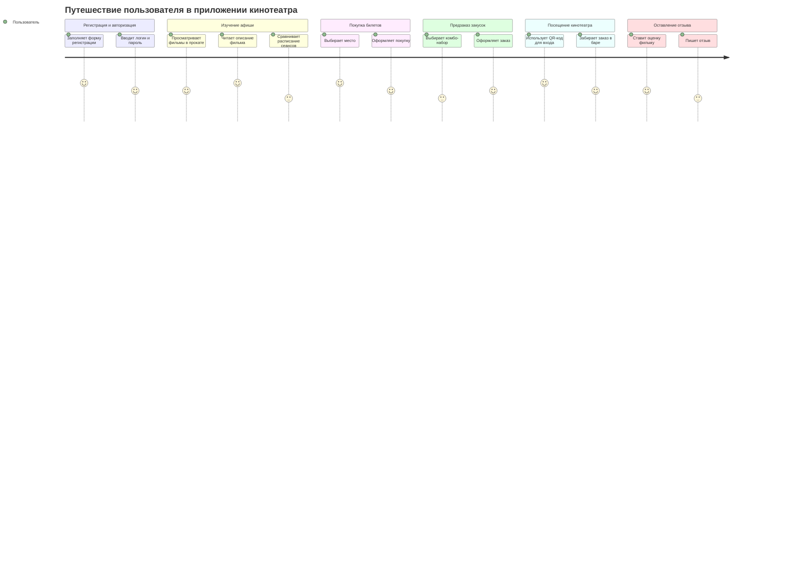
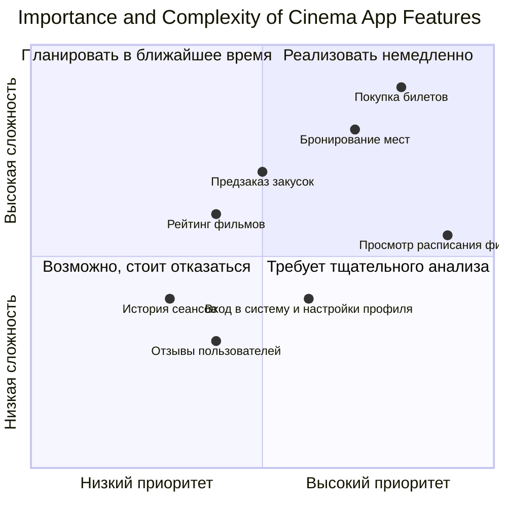
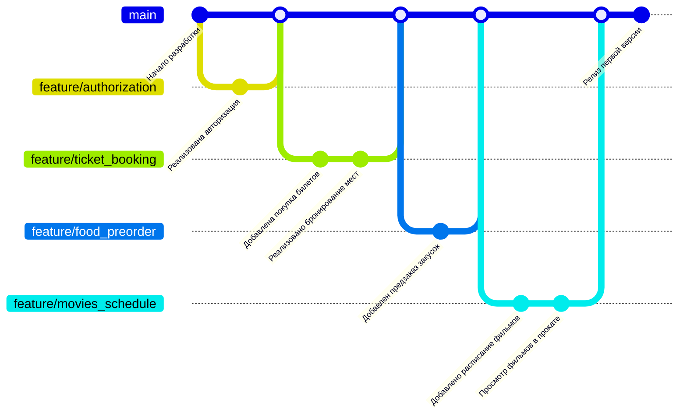

#mindmap
### 1. Диаграмма Mindmap

Система приложения для кинотеатра предназначена для упрощения взаимодействия пользователей с кинотеатром. Она позволяет просматривать расписание, бронировать места, покупать билеты, заказывать закуски и оставлять отзывы. Приложение также предоставляет инструменты для администрации, улучшая управление и взаимодействие с клиентами, что повышает удобство и эффективность работы кинотеатра.

### 2. Диаграмма путешествия пользователя (User Journey Diagram)

### 3. Квадрант-граф

### 4. Гит граф (Gitgraph)

